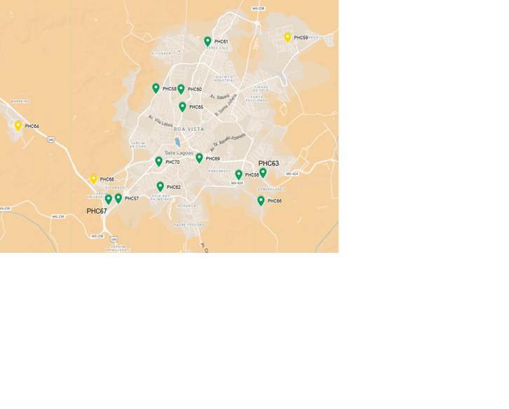

# Three-Level Hierarchical Health Care planning model to increase accessibility and equity on municipality level

Este projeto utiliza o **GLPK (GNU Linear Programming Kit)** para resolver um problema de localização de unidades de saúde no município de Sete Lagoas – MG. O modelo foi construído com base em critérios de equidade, cobertura, custo e capacidade instalada, visando à organização racional da Rede de Atenção Primária à Saúde (APS).

---

## 📁 Estrutura do Projeto

```
Planejamento_APS_SeteLagoas/
├── model/
│   └── hc.mod
├── data/
│   └── SL.dat
├── images/
│   └── localizacao_novas_unidades.png
├── README.md
```

---

## 📌 Objetivo

Propor um plano de localização para unidades de saúde que atenda à demanda da população, respeitando os critérios de cobertura geográfica e capacidade das equipes, com foco principal na APS.

---

## ▶️ Como Executar

1. Instale o GLPK: https://www.gnu.org/software/glpk/

2. Execute no terminal:

```bash
glpsol -m hc.mod -d SL.dat --cuts
```

---

## 📊 Resultados da Modelagem

### Análise dos Resultados

A solução ótima respeita as restrições do modelo e garante cobertura universal da APS. A seguir estão os principais resultados:

### Caracterização Financeira

**Custo APS:** R$ 105.851.181,35 (necessidade de investimento de R$ 15.451.205,35)

| Parâmetros (*resultados da otimização)    | Valor (R$)         |
|-------------------------------------------|--------------------|
| Receita do município (2025)               | 1.635.941.154,00      |
| Orçamento para Saúde (2025)               | 583.933.738,00      |
| Orçamento Média-Alta complexidade (2025)  | 412.423.111,00      | 
| Orçamento MAC (ajustado p/ modelo) (2025)  | 282.993.086,00      | 
|-------------------------------------------|--------------------|
| PHC-Orçamento Atenção Básica (2025)       | 90.399.976,00     |
|-------------------------------------------|--------------------|
| *Custo Logístico                            | 491.250,15         |
| *Custo Fixo Unidades Existentes [E]         | 42.900.000,00      |
| *Custo Fixo Novas Unidades [C]              | 9.360.000,00         |
| *Custo de Nova Equipe [C]                   | 8.698.519,20         |
| *Custo Variável                              | 44.401.412,00     |
|-------------------------------------------|--------------------|
| *PHC-Custo Atenção Básica (2025)       | 105.851.181,35     |
|-------------------------------------------|--------------------|

---

### Novas Unidades Criadas

12 de 15 localidades candidatas foram selecionadas.



---

### Novas Equipes

15 novas equipes foram alocadas.

| Unidade | Nº eSFs | ME1 | EF1 | TE1 | ACS | DE1 | TD1 |
|---------|---------|-----|-----|-----|-----|-----|-----|
| PHC56   | 2       | 2   | 2   | 2   | 8   | 2   | 2   |
| PHC57   | 1       | 1   | 1   | 1   | 4   | 1   | 1   |
| ...     | ...     | ... | ... | ... | ... | ... | ... |

---

### Equipes Existentes

- Boa distribuição de médicos, enfermeiros e técnicos
- Déficit na Equipe de Saúde Bucal
- ACSs com distribuição desigual
- eMulti estável e fortalecida por políticas federais

---

### Capacidade Utilizada

#### APS – Utilização próxima de 100%

| Unidade | Capacidade Total | Utilizada | % |
|---------|------------------|-----------|----|
| PHC1    | 3000             | 3000      |100%|
| PHC2    | 6000             | 6000      |100%|
| ...     | ...              | ...       |... |

*Nota: existe margem caso use-se o teto de 3.500 pessoas por UBS.*

#### SHC – Subutilização de 2% a 75%  
#### THC – Subutilização alta, mas explicada por limitações do modelo

---

---

## 📜 Licença

MIT

## ✉️ Contato
João Flávio F. Almeida  
📧 [joao.flavio@dep.ufmg](mailto:joao.flavio@dep.ufmg)

Thiago Mendanha  
📧 [mbm.thiago@gmail.com](mailto:mbm.thiago@gmail.com)
